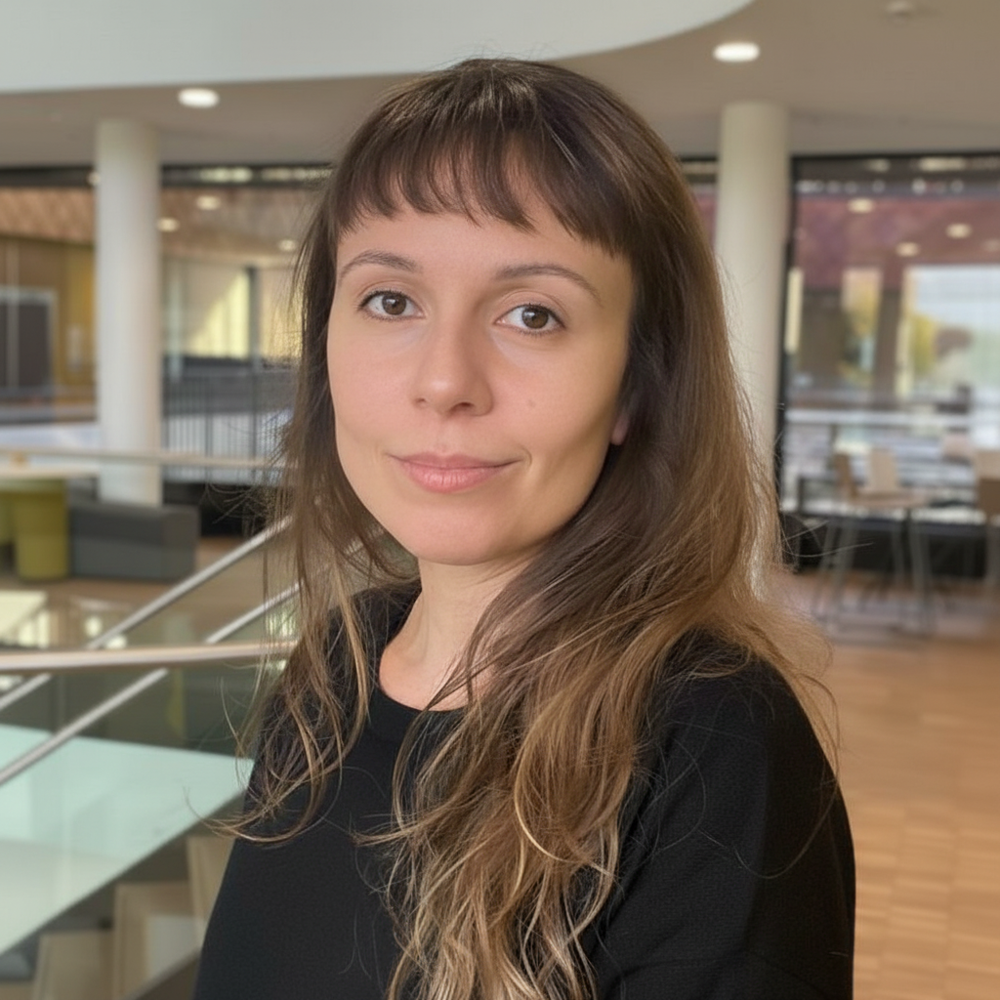

## Research interests

profile_photo.png
My research focuses on understanding how taxonomic and functional facets of biodiversity drive ecosystem functioning under the optic of a changing world. Most of my work is on natural grassland systems, but I also have experienced the marine world and worked with dolphins. I like to explore ecological theory in the field, from observation to experimentation, and now, more recently, in synthesizing existing data. The questions I'm particularly interested in comprise the disciplines of community ecology and macroecology.

## Research projects
The main project I'm currently working on is a synthesis to directly examine the effects of plant species loss on productivity.

### Other projects & community service
I am one of the PIs of the successful iDiv Female Scientists initiative. This initiative was created to connect women researchers, provide training on specific skills, raise awareness about gender inequalities, and improve working conditions. It is an autonomous initiative funded by the [iDiv Female Scientists Career Fund](https://www.idiv.de/en/about-idiv/support-for-scientists/female-career-fund.html). 
Since April 2023, we have held monthly networking lunch meetings. Additionally, we organize an extra monthly event, such as a movie session, an expert talk, or a workshop.
[Contact me](https://danielahoss.github.io/Contact) if you are interested! 
