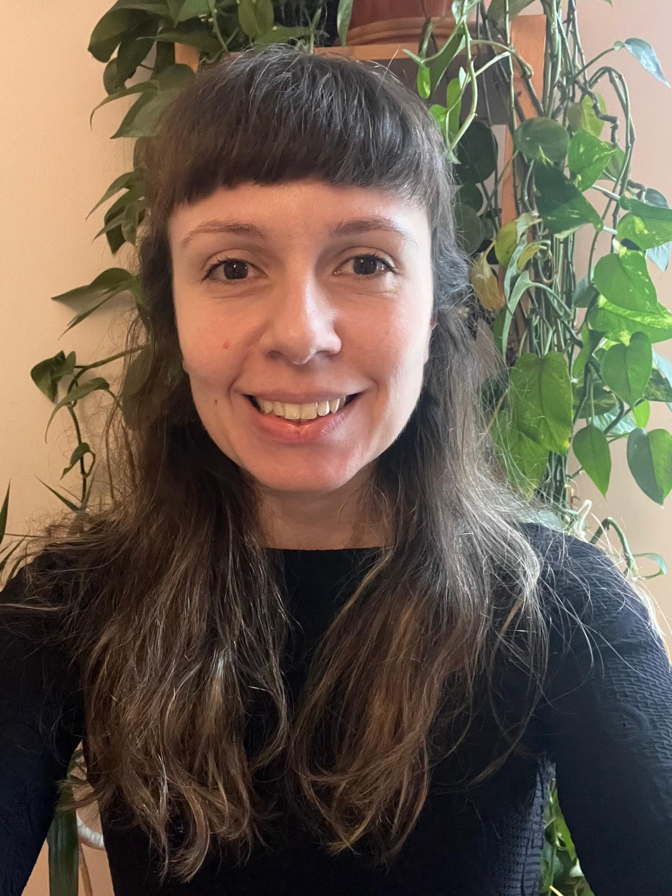

## Research interests

My research investigates how taxonomic and trait diversity drive ecosystem functioning in a rapidly changing world. While my primary focus is on natural grassland ecosystems, my background also includes marine ecology, specifically studying dolphin populations.

I integrate ecological theory across scales, from field observations and manipulative experiments to evidence synthesis. My work sits at the intersection of community ecology and macroecology, aiming to understand how species loss and climate extremes translate into biodiversity changes and impact ecosystem stability.

## Current Focus
To enhance predictions of how biodiversity loss affects ecosystem functioning, I am leading a comprehensive evidence synthesis that directly examines how non-random species loss—targeting species based on relative abundance, competitive strength, or specific traits—impacts productivity.

### Other projects

Alongside three other Co-PIs, I am actively involved in the autonomous iDiv Female Scientists Initiative, which is dedicated to fostering gender equity and professional development within the scientific community. Our mission is to connect women researchers, provide skill-building workshops, and advocate for improved working conditions

Key Activities:
Networking: Monthly meetings to build community and mentorship connections.
Professional Development: Expert talks, workshops, and collaborative events focused on career experiences.
Community Building: Regular social and educational events to strengthen the research network.

Get Involved: We welcome new members. If you are a woman researcher interested in joining our network or collaborating on future events, [Contact Me].

### Other projects

You can find more about me and other projects [here](ShortCV_DanielaHoss_CV_20260102.pdf).
