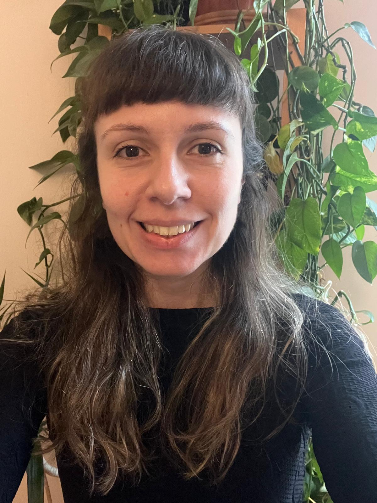

## About me
[Google Scholar]([https://scholar.google.com/](https://scholar.google.com/citations?hl=en&user=sYbqU_wAAAAJ)  \|  [ORCID](https://orcid.org/0000-0002-6766-3904)  \|  [Publons](https://publons.com/researcher/1910318/daniela-hoss/)

                                      

**Daniela Hoss, PhD**

*Postdoctoral Researcher, [iDiv](https://www.idiv.de/en/sdiv.html) - German Centre for Integrative Biodiversity Research*

I’m a cat lover and grassland ecologist intrigued by how biodiversity changes in the Anthropocene shape our ecosystems. My research examines the complex relationships between biodiversity and ecosystem functioning, with a focus on how species loss and climate extremes influence these dynamics.
To address these challenges, I use a combination of observational, experimental, and synthesis approaches, with a particular enthusiasm for experiments that simulate scenarios of species extinction.

Jan 2022 - now: **Postdoc** in the [sDiv](https://www.idiv.de/en/sdiv.html) Synthesis Centre at [iDiv](https://www.idiv.de/en/sdiv.html), working in collaboration with [Prof Dr. Helge Bruelheide](https://www.botanik.uni-halle.de/geobotanik/helge_bruelheide/), [Prof Dr. Jonathan Chase](https://www.idiv.de/en/groups-and-people/core-groups/synthesis.html), and [Prof. Dr. Valério Pillar](https://www.researchgate.net/profile/Valerio-Pillar). (Germany)

Mar 2017 - Nov 2021: **PhD** at [Dept of Ecology. Universidade Federal do Rio Grande do Sul (PT)](https://www.ufrgs.br/ppgecologia/)/ [(EN)](https://www.ufrgs.br/ppgecologia/en/). (Brazil)

 

