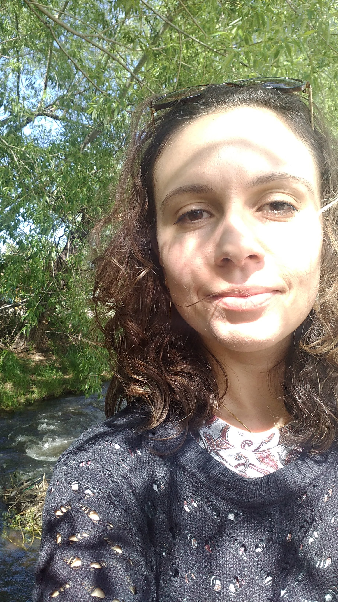
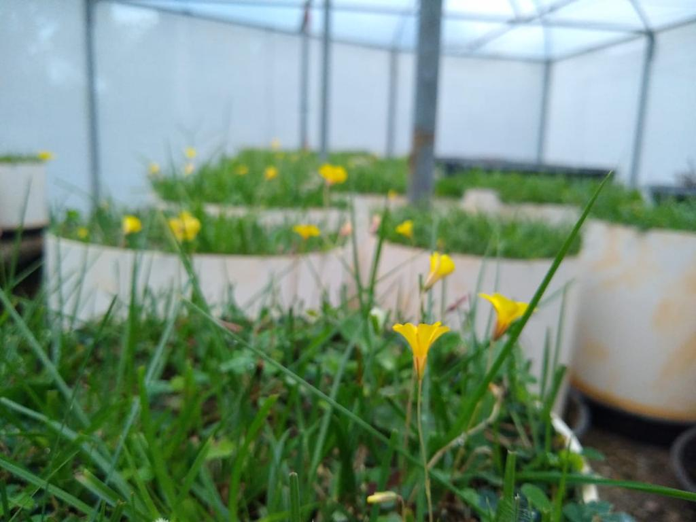

## About me
[Google Scholar](https://scholar.google.com/)  \|  [ORCID](https://orcid.org/0000-0002-6766-3904)  \|  [Publons](https://publons.com/researcher/1910318/daniela-hoss/)

                                      

**Daniela Hoss, PhD**

*Postdoctoral Researcher, [iDiv](https://www.idiv.de/en/sdiv.html) - German Centre for Integrative Biodiversity Research*

I am a grassland ecologist with a particular interest in biodiversity changes during the Anthropocene. My research focuses on understanding the relationships between biodiversity and ecosystem functioning, particularly how these relationships are affected by species loss and climate change. To explore these topics, I employ experimental and observational studies and am particularly enthusiastic about removal experiments. Additionally, I am interested in ecological restoration and the ecology of invasive plants.

Jan 2022 - now: **Postdoc** in the [sDiv](https://www.idiv.de/en/sdiv.html) Synthesis Centre at [iDiv](https://www.idiv.de/en/sdiv.html), working in collaboration with [Prof Dr. Helge Bruelheide](https://www.botanik.uni-halle.de/geobotanik/helge_bruelheide/), [Prof Dr. Jonathan Chase](https://www.idiv.de/en/groups-and-people/core-groups/synthesis.html), and [Prof. Dr. Valério Pillar](https://www.researchgate.net/profile/Valerio-Pillar). (Germany)

Mar 2017 - Nov 2021: **PhD** at [Department of Ecology. Universidade Federal do Rio Grande do Sul (PT)](https://www.ufrgs.br/ppgecologia/)/ [(EN)](https://www.ufrgs.br/ppgecologia/en/), working with [Valério Pillar](https://www.researchgate.net/profile/Valerio-Pillar) on Grassland vegetation ecology. (Brazil)

 

