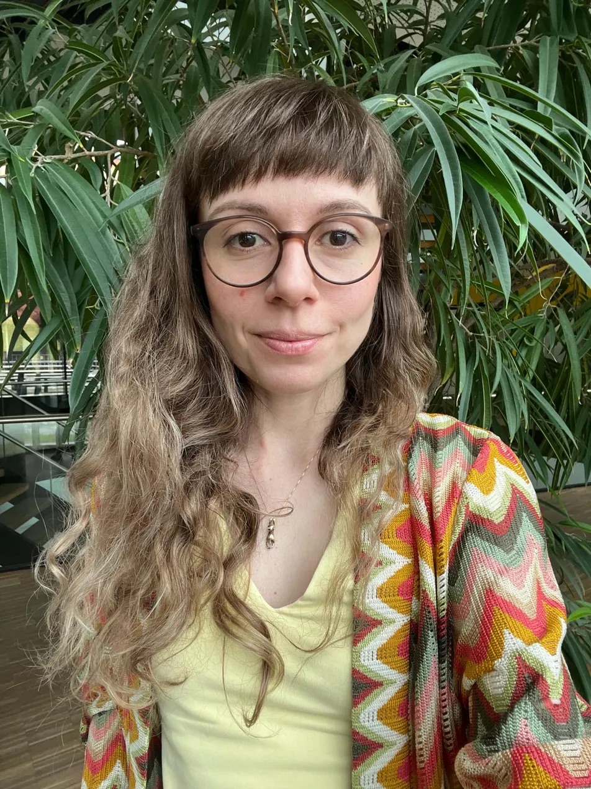
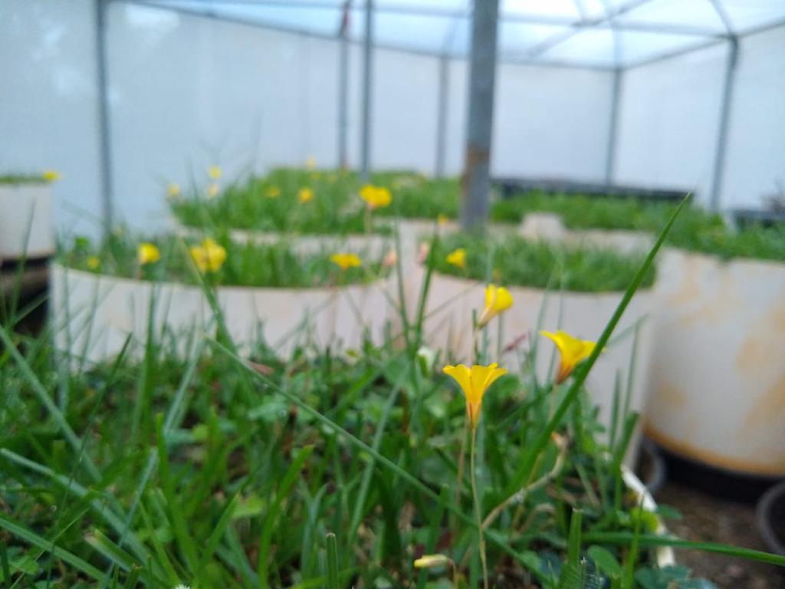

## About me
[Google Scholar](https://scholar.google.com/citations?hl=en&user=sYbqU_wAAAAJ)  \|  [ORCID](https://orcid.org/0000-0002-6766-3904)  \|  [Publons](https://publons.com/researcher/1910318/daniela-hoss/)

Jan 2026 - present: [iDiv](https://www.idiv.de/en/sdiv.html) guest researcher

I study how biodiversity loss reshapes ecosystem functioning, using evidence synthesis and manipulative field experiments across grasslands worldwide. My research investigates how naturally assembled communities, particularly species relative abundances and trait-based diversity, moderate productivity in grasslands, and how these relationships are affected by species extirpations and extreme climatic events. I use manipulative field experiments, statistical modelling, and evidence synthesis to understand the mechanisms underlying community assembly and ecosystem responses to change. I am also actively involved in initiatives promoting equity in science, with a particular focus on women and early-career researchers.

Jan 2022 - Dec 2025: Postdoctoral Researcher in the Synthesis Centre [sDiv](https://www.idiv.de/en/sdiv.html) at the German Centre for Integrative Biodiversity Research [iDiv](https://www.idiv.de/en/sdiv.html) Halle-Jena-Leipzig, Leipzig, Germany

Mar 2017 - Nov 2021: **PhD**, Dept of Ecology. Universidade Federal do Rio Grande do Sul, Brazil [(PT)](https://www.ufrgs.br/ppgecologia/) [(EN)](https://www.ufrgs.br/ppgecologia/en/)

 

