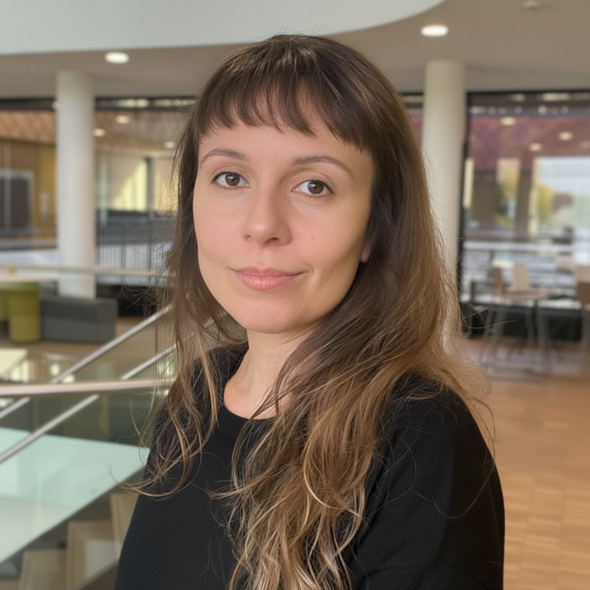

## About me
[Google Scholar](https://scholar.google.com/citations?hl=en&user=sYbqU_wAAAAJ)  \|  [ORCID](https://orcid.org/0000-0002-6766-3904)  \|  [Publons](https://publons.com/researcher/1910318/daniela-hoss/)

                                      

Jan 2022 - now: Postdoctoral Researcher in the Synthesis centre [sDiv](https://www.idiv.de/en/sdiv.html) at the German Centre for Integrative Biodiversity Research [iDiv](https://www.idiv.de/en/sdiv.html) Halle-Jena-Leipzig, Leipzig, Germany

I am a plant community ecologist working on grassland diversity and ecosystem functioning. My research investigates how naturally assembled communities, particularly species relative abundances and trait-based diversity, moderate productivity in grasslands, and how these relationships are affected by species extirpations and extreme climatic events. I use manipulative field experiments, statistical modelling, and cross-site synthesis to understand the mechanisms underlying community assembly and ecosystem responses to these changes. I am also involved in initiatives to promote equity in science, particularly for women and early-career researchers.

Mar 2017 - Nov 2021: **PhD** at [Dept of Ecology. Universidade Federal do Rio Grande do Sul (PT)](https://www.ufrgs.br/ppgecologia/)/ [(EN)](https://www.ufrgs.br/ppgecologia/en/). (Brazil)

 

